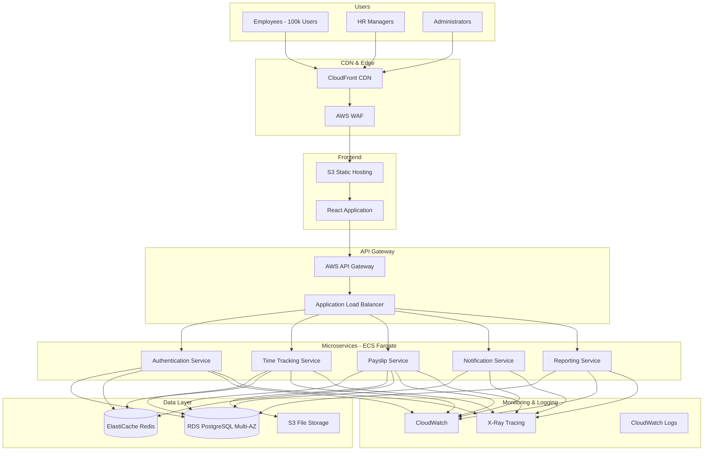
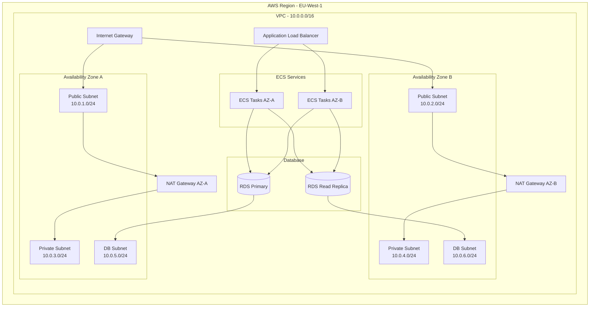
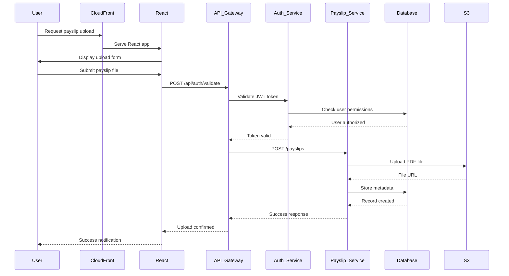
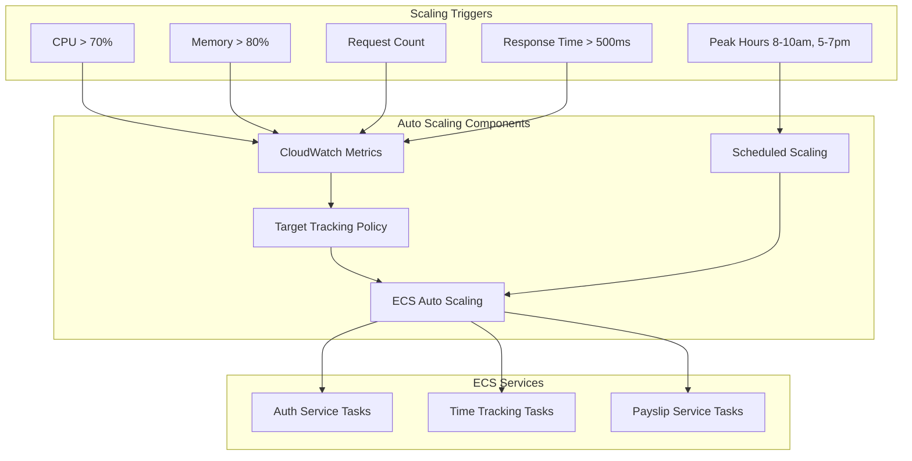
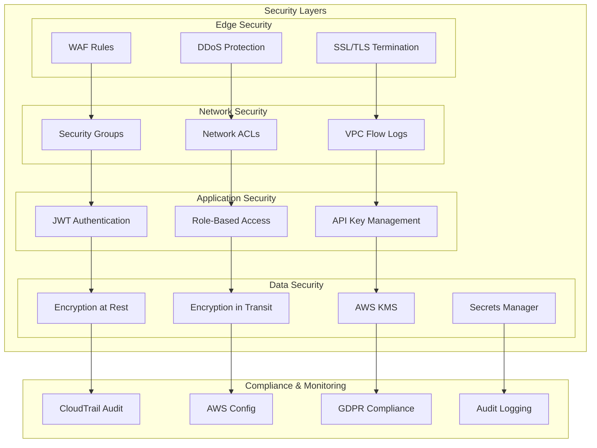

# HR Platform System Architecture Diagram

## High-Level Architecture

```mermaid
graph TB
    subgraph "Users"
        U1[Employees - 100k Users]
        U2[HR Managers]
        U3[Administrators]
    end

    subgraph "CDN & Edge"
        CF[CloudFront CDN]
        WAF[AWS WAF]
    end

    subgraph "Frontend"
        S3[S3 Static Hosting]
        REACT[React Application]
    end

    subgraph "API Gateway"
        APIGW[AWS API Gateway]
        LB[Application Load Balancer]
    end

    subgraph "Microservices - ECS Fargate"
        AUTH[Authentication Service]
        TIME[Time Tracking Service]
        PAY[Payslip Service]
        NOTIF[Notification Service]
        REPORT[Reporting Service]
    end

    subgraph "Data Layer"
        RDS[(RDS PostgreSQL Multi-AZ)]
        REDIS[(ElastiCache Redis)]
        S3FILES[S3 File Storage]
    end

    subgraph "Monitoring & Logging"
        CW[CloudWatch]
        XRAY[X-Ray Tracing]
        LOGS[CloudWatch Logs]
    end

    U1 --> CF
    U2 --> CF
    U3 --> CF
    CF --> WAF
    WAF --> S3
    S3 --> REACT
    REACT --> APIGW
    APIGW --> LB
    LB --> AUTH
    LB --> TIME
    LB --> PAY
    LB --> NOTIF
    LB --> REPORT

    AUTH --> RDS
    TIME --> RDS
    PAY --> RDS
    PAY --> S3FILES
    NOTIF --> RDS
    REPORT --> RDS

    AUTH --> REDIS
    TIME --> REDIS
    PAY --> REDIS

    AUTH --> CW
    TIME --> CW
    PAY --> CW
    NOTIF --> CW
    REPORT --> CW

    AUTH --> XRAY
    TIME --> XRAY
    PAY --> XRAY
    NOTIF --> XRAY
    REPORT --> XRAY
```

## Network Architecture

```mermaid
graph TB
    subgraph "AWS Region - EU-West-1"
        subgraph "VPC - 10.0.0.0/16"
            subgraph "Availability Zone A"
                PUB1[Public Subnet<br/>10.0.1.0/24]
                PRIV1[Private Subnet<br/>10.0.3.0/24]
                DB1[DB Subnet<br/>10.0.5.0/24]
            end
            
            subgraph "Availability Zone B"
                PUB2[Public Subnet<br/>10.0.2.0/24]
                PRIV2[Private Subnet<br/>10.0.4.0/24]
                DB2[DB Subnet<br/>10.0.6.0/24]
            end
            
            IGW[Internet Gateway]
            NAT1[NAT Gateway AZ-A]
            NAT2[NAT Gateway AZ-B]
            ALB[Application Load Balancer]
            
            subgraph "ECS Services"
                ECS1[ECS Tasks AZ-A]
                ECS2[ECS Tasks AZ-B]
            end
            
            subgraph "Database"
                RDS_PRIMARY[(RDS Primary)]
                RDS_REPLICA[(RDS Read Replica)]
            end
        end
    end

    IGW --> PUB1
    IGW --> PUB2
    PUB1 --> NAT1
    PUB2 --> NAT2
    NAT1 --> PRIV1
    NAT2 --> PRIV2
    
    ALB --> ECS1
    ALB --> ECS2
    ECS1 --> RDS_PRIMARY
    ECS2 --> RDS_PRIMARY
    ECS1 --> RDS_REPLICA
    ECS2 --> RDS_REPLICA
    
    RDS_PRIMARY --> DB1
    RDS_REPLICA --> DB2
```

## Service Communication Flow

```mermaid
sequenceDiagram
    participant User
    participant CloudFront
    participant React
    participant API_Gateway
    participant Auth_Service
    participant Payslip_Service
    participant Database
    participant S3

    User->>CloudFront: Request payslip upload
    CloudFront->>React: Serve React app
    React->>User: Display upload form
    
    User->>React: Submit payslip file
    React->>API_Gateway: POST /api/auth/validate
    API_Gateway->>Auth_Service: Validate JWT token
    Auth_Service->>Database: Check user permissions
    Database-->>Auth_Service: User authorized
    Auth_Service-->>API_Gateway: Token valid
    
    API_Gateway->>Payslip_Service: POST /payslips
    Payslip_Service->>S3: Upload PDF file
    S3-->>Payslip_Service: File URL
    Payslip_Service->>Database: Store metadata
    Database-->>Payslip_Service: Record created
    Payslip_Service-->>API_Gateway: Success response
    API_Gateway-->>React: Upload confirmed
    React-->>User: Success notification
```

## Auto-scaling Architecture

```mermaid
graph TB
    subgraph "Auto Scaling Components"
        CW_METRICS[CloudWatch Metrics]
        ASG[ECS Auto Scaling]
        TARGET_TRACKING[Target Tracking Policy]
        SCHEDULED[Scheduled Scaling]
    end

    subgraph "Scaling Triggers"
        CPU[CPU > 70%]
        MEMORY[Memory > 80%]
        REQUEST_COUNT[Request Count]
        RESPONSE_TIME[Response Time > 500ms]
        PEAK_HOURS[Peak Hours 8-10am, 5-7pm]
    end

    subgraph "ECS Services"
        AUTH_TASKS[Auth Service Tasks]
        TIME_TASKS[Time Tracking Tasks]
        PAY_TASKS[Payslip Service Tasks]
    end

    CPU --> CW_METRICS
    MEMORY --> CW_METRICS
    REQUEST_COUNT --> CW_METRICS
    RESPONSE_TIME --> CW_METRICS
    
    CW_METRICS --> TARGET_TRACKING
    PEAK_HOURS --> SCHEDULED
    
    TARGET_TRACKING --> ASG
    SCHEDULED --> ASG
    
    ASG --> AUTH_TASKS
    ASG --> TIME_TASKS
    ASG --> PAY_TASKS
```

## Security Architecture

```mermaid
graph TB
    subgraph "Security Layers"
        subgraph "Edge Security"
            WAF_RULES[WAF Rules]
            DDOS[DDoS Protection]
            SSL[SSL/TLS Termination]
        end
        
        subgraph "Network Security"
            SG[Security Groups]
            NACL[Network ACLs]
            VPC_FLOW[VPC Flow Logs]
        end
        
        subgraph "Application Security"
            JWT[JWT Authentication]
            RBAC[Role-Based Access]
            API_KEYS[API Key Management]
        end
        
        subgraph "Data Security"
            ENCRYPTION_REST[Encryption at Rest]
            ENCRYPTION_TRANSIT[Encryption in Transit]
            KMS[AWS KMS]
            SECRETS[Secrets Manager]
        end
    end

    subgraph "Compliance & Monitoring"
        CLOUDTRAIL[CloudTrail Audit]
        CONFIG[AWS Config]
        GDPR[GDPR Compliance]
        AUDIT_LOGS[Audit Logging]
    end

    WAF_RULES --> SG
    SG --> JWT
    JWT --> ENCRYPTION_REST
    ENCRYPTION_REST --> CLOUDTRAIL
    
    DDOS --> NACL
    NACL --> RBAC
    RBAC --> ENCRYPTION_TRANSIT
    ENCRYPTION_TRANSIT --> CONFIG
    
    SSL --> VPC_FLOW
    VPC_FLOW --> API_KEYS
    API_KEYS --> KMS
    KMS --> GDPR
    
    SECRETS --> AUDIT_LOGS
```
